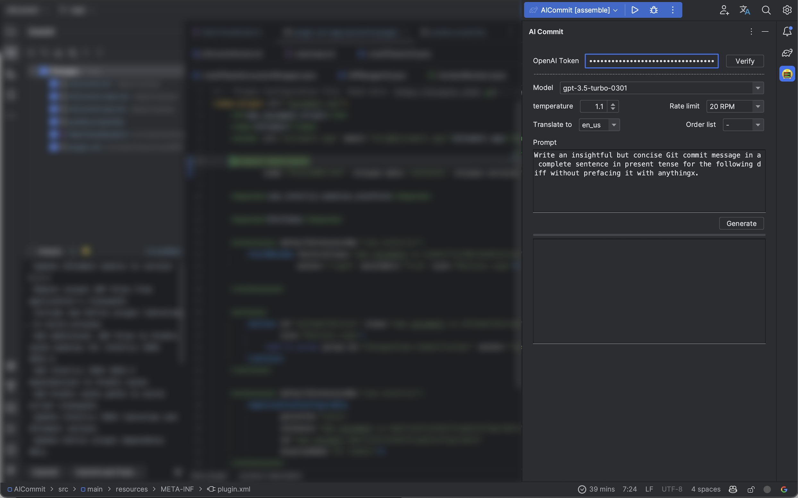
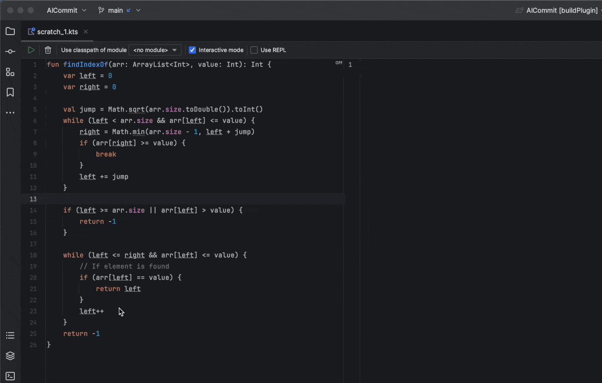
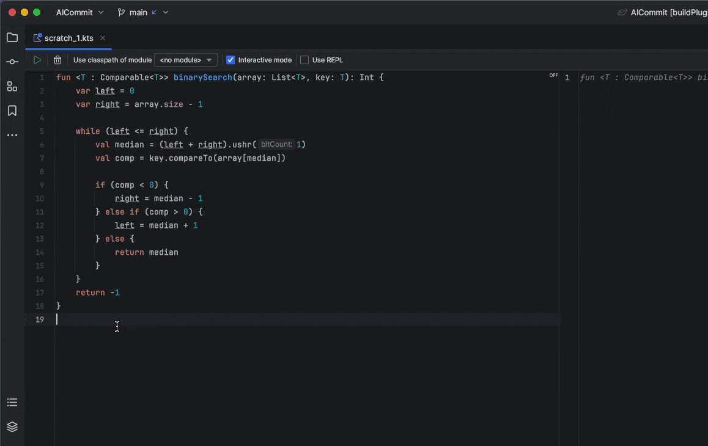

# AICommit

AICommit — 面向 JetBrains IDE 的 AI 助手！

- 使用 GPT 的智能提交信息编写器
- 在编辑器中弹出 AI 驱动的功能：代码优化、代码解释、文档生成、代码转换和翻译
- 支持自定义提示和各种参数调整
- 与 JetBrains 产品无缝集成，为用户提供卓越的使用体验
- 对于变更文件数量较多的情况，采用并行处理，以实现极快的速度
- 注重隐私保护：我们不收集任何代码信息或提交信息
- 使用 AICommit 升级您的编程工作流程 —— 您的全方位 AI 编程助手！

## 安装

- 使用IDE内置插件系统：

  <kbd>设置/首选项</kbd> > <kbd>插件</kbd> > <kbd>市场</kbd> > <kbd>搜索 “AICommit”</kbd> >
  <kbd>安装插件</kbd>

## 配置 [OpenAI Token](https://platform.openai.com/account/api-keys)

在 AiCommit 插件中，您需要输入 OpenAI 访问令牌以开始使用该插件。在 AiCommit 窗口的顶部，输入您的 OpenAI 访问令牌。然后，单击“验证”以确保您的访问令牌有效。

## 入门

安装了插件并成功配置了您的 OpenAI 令牌后，您就可以开始使用 AiCommit。您现在可以在当前项目上启动AiCommit并开始生成提交信息。单击窗口底部的“生成”按钮以为您的项目创建提交信息。

### 生成提交信息

### 代码解释

### 代码转换

### 代码优化

### 文档生成

## 路线图

- [x] 本地化插件
- [x] 带有进度状态的提交操作。
- [x] 仅针对选定文件生成提交信息。
- [x] 聊天模式
- [x] 支持代码文档生成
- [x] 支持代码生成、代码优化、代码解释和文本翻译
- [ ] 支持过滤文件或文件夹。
- [ ] 支持更多的提交信息模板，前缀和后缀。
- [ ] 支持GPT-4 API

## [FAQ](./FAQ.md)

---

## 感谢

- [AICommit](https://github.com/Nutlope/aicommits)：一款使用AI为您编写Git提交信息的CLI。再也不用编写提交信息。
- [Openai-Kotlin](https://github.com/aallam/openai-kotlin)：具有多平台和协程功能的OpenAI API的Kotlin客户端。
- [java-diff-utils](https://github.com/java-diff-utils/java-diff-utils)
- [knuddelsgmbh/jtokkit](https://github.com/knuddelsgmbh/jtokkit)
- 基于[ JetBrains平台插件模板][template]的插件。
- Deja Vu by Cykarl https://soundcloud.com/cykarl
  Creative Commons — Attribution 3.0 Unported — CC BY 3.0
  Free Download / Stream: https://bit.ly/3IPXpnU
  Music promoted by Audio Library https://youtu.be/-tPlIz3eov4

[template]: https://github.com/JetBrains/intellij-platform-plugin-template