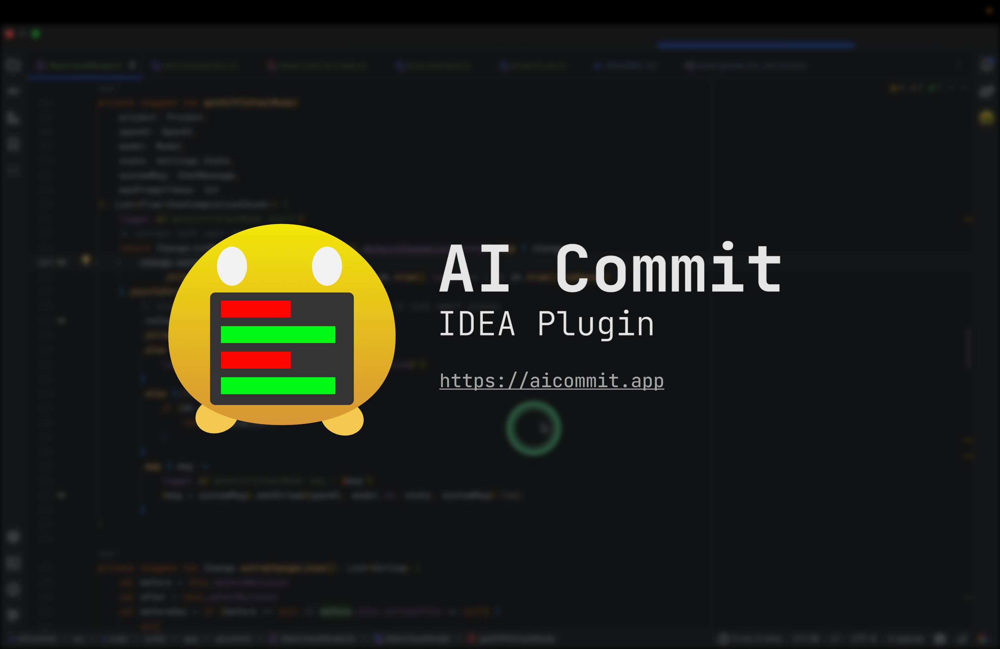
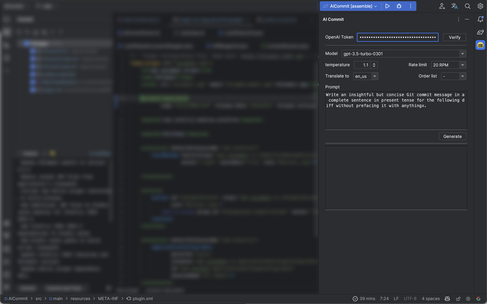
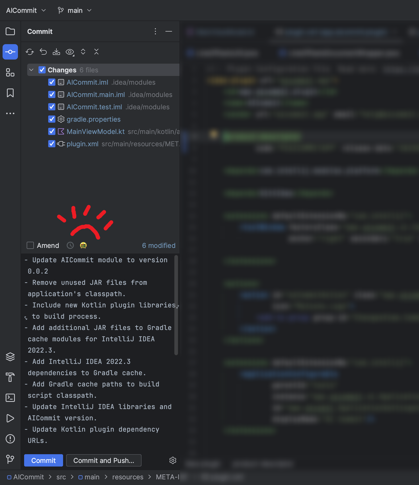
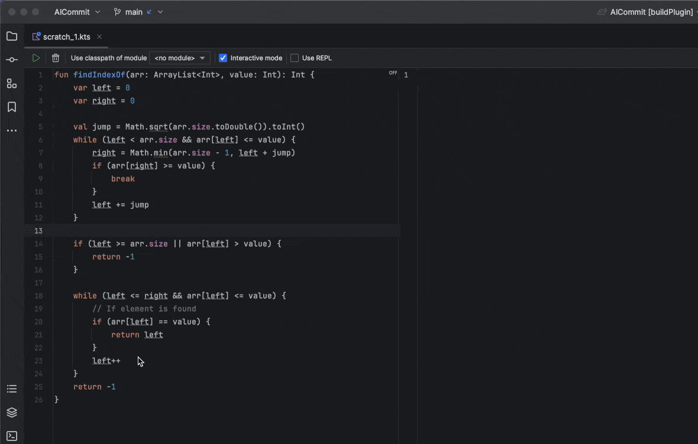
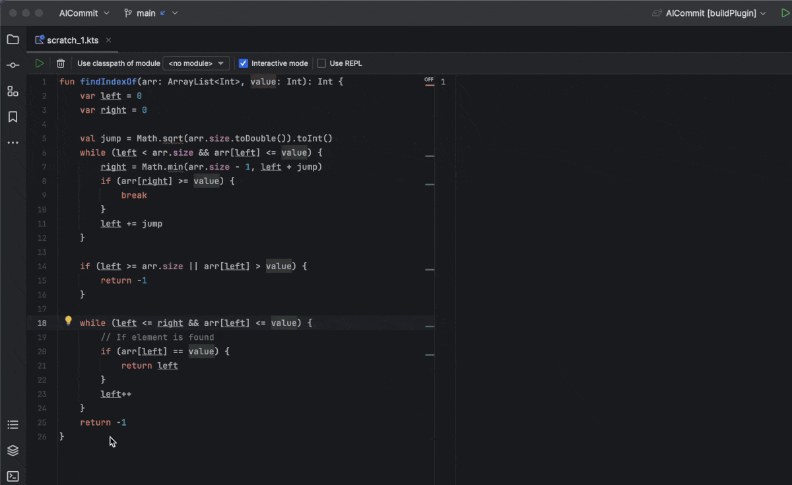
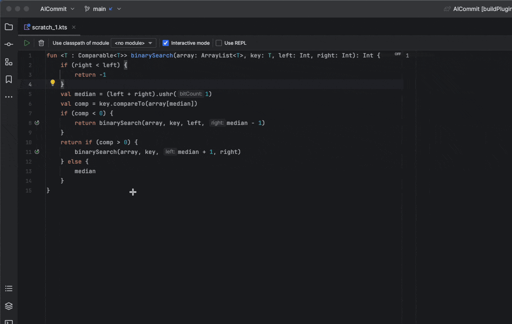
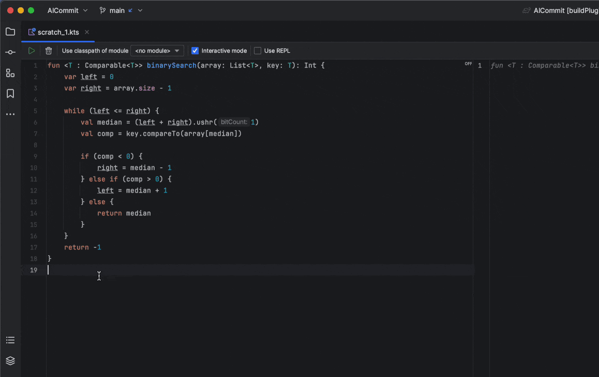

# AICommit
[中文简体](README-zh_cn.md)

AI-powered programming assistant for JetBrains IDEs!

- Intelligent commit message writer using GPT
- In-editor pop-up for AI-driven features: code optimization, code explanation, documentation generation, code conversion, and translation
- Supporting custom prompts and various parameter adjustments
- Seamless integration with JetBrains products for an excellent user experience
- Parallel processing for scenarios with a large number of changed files, resulting in blazingly fast speeds
- Privacy-first approach: We do not collect any code information or commit messages

Upgrade your coding workflow with AICommit – your all-in-one AI programming assistant!

## Installation

- Using IDE built-in plugin system:

  <kbd>Settings/Preferences</kbd> > <kbd>Plugins</kbd> > <kbd>Marketplace</kbd> > <kbd>Search for "AICommit"</kbd> >
  <kbd>Install Plugin</kbd>

## Configuring [OpenAI Token](https://platform.openai.com/account/api-keys)
In the AiCommit plugin, you'll need to enter your OpenAI access token to start using the plugin. At the top of the AiCommit window, enter your OpenAI access token. Then, click "Verify" to ensure your access token is valid.

## Getting Started
Once you have successfully installed the plugin and configured your OpenAI token, you're ready to start using AiCommit. You can now launch AiCommit on your current project and begin generating commit messages. Click the "Generate" button at the bottom of the window to create a commit message for your project.

### Generate Commit Message

### Explain Code

### Code Translate

### Code Optimization

### Code Documentation

## Roadmap

- [x] Localize the plugin
- [x] Commit Action with progress status.
- [x] Generating commit information only for selected files.
- [x] Chat Mode (for now).
- [x] Support for code documentation generation, code optimization, explain code and translation.
- [ ] Supports filtering files or folders.
- [ ] Support for more commit message templates, prefixes, and suffixes.
- [ ] Support for GPT-4 API

---

## Credit
- [AICommit](https://github.com/Nutlope/aicommits):A CLI that writes your git commit messages for you with AI. Never write a commit message again.
- [Openai-Kotlin](https://github.com/aallam/openai-kotlin): Kotlin client for OpenAI's API with multiplatform and coroutines capabilities.
- [java-diff-utils](https://github.com/java-diff-utils/java-diff-utils)
- [knuddelsgmbh/jtokkit](https://github.com/knuddelsgmbh/jtokkit)
- Plugin based on the [IntelliJ Platform Plugin Template][template].
- Deja Vu by Cykarl https://soundcloud.com/cykarl
  Creative Commons — Attribution 3.0 Unported — CC BY 3.0
  Free Download / Stream: https://bit.ly/3IPXpnU
  Music promoted by Audio Library https://youtu.be/-tPlIz3eov4

[template]: https://github.com/JetBrains/intellij-platform-plugin-template
